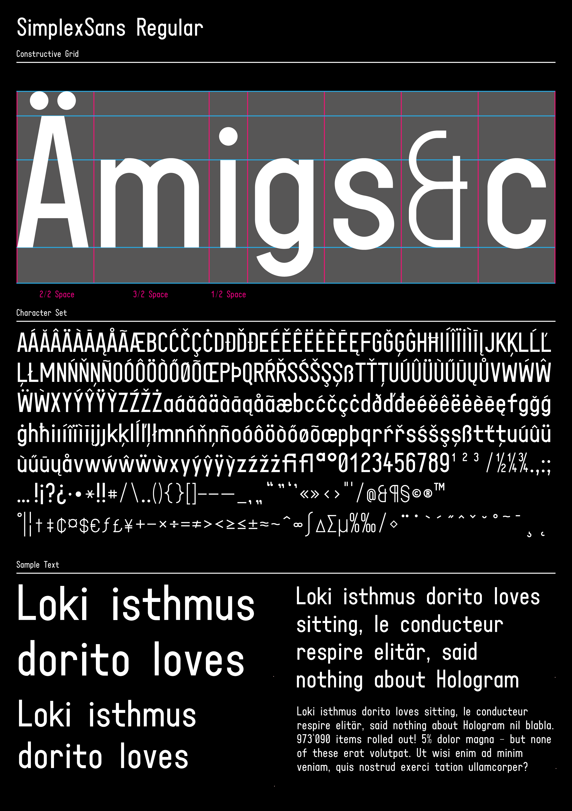

# SimplexSans Regular

**SimplexSans** is a modular, grid-based display typeface inspired by the era of manual lettering — a time when type wasn’t designed on screens, but drawn by hand with ruler and compass. The typeface was originally created in the early 1990s, digitized in 1998, and redesigned and completed in 2025. 



## Concept

SimplexSans was developed as a typographic experiment rooted in analog construction techniques. Every glyph is based on a strict modular system, allowing the shapes to be drawn manually on graph paper using only a ruler and a compass. The result is a display typeface that feels both mechanical and human, rational and playful. 

## Design Characteristics

- Geometric, monolinear construction
- Based on a triospace grid system, no kerning! 
- Normal characters (a, b, n, etc.) are 2 units wide, narrow characters (I, i, l, etc.) 1 are unit wide and wide characters (W, m, etc.) are 3 units wide
- Designed for display use: headlines, signage, editorial experiments
- Trispace font: to allow rhythmic typographic patterns without relying on variable widths or kerning
- No optical corrections — all shapes are purely constructed and follow the logic of the grid
- Special characters are typically drawn with half the stroke width

## Technical Details

- Formats: OTF and TTF
- Character set includes:
  - Basic Latin (A–Z, a–z, numerals, punctuation)
  - Essential symbols and selected extended Latin characters
- No kerning — spacing is fully modular

## About

Designed by [Markus Popp](https://github.com/markuspopp)

## License

This Font Software is licensed under the SIL Open Font License, Version 1.1.
This license is available with a FAQ at https://openfontlicense.org

## Build

This font project was built from a `.glyphs` source file and post-processed to meet the technical requirements of the Google Fonts project.

### Build process

The `.ttf` font was generated using [fontmake](https://github.com/googlefonts/fontmake) from the source file `sources/SimplexSans-Regular.glyphs`:

```
fontmake -g sources/SimplexSans-Regular.glyphs -i -o ttf --output-dir fonts/
```

This produced a basic TTF font containing the design outlines and font metadata defined in the Glyphs source.

### Post-processing

After initial generation, the TTF file was manually post-processed using Python scripts and the fontTools and gftools libraries.

The following corrections and enhancements were applied:

- Set fsType to 0 to allow unrestricted installation and embedding
- Enabled USE_TYPO_METRICS (OS/2.fsSelection bit 7) for consistent vertical metrics across platforms
- Removed Typographic Family Name (nameID 16) and Typographic Subfamily Name (nameID 17) for a single-weight family
- Adjusted usWeightClass to match the subfamily style name
- Replaced incorrect or incomplete nameID records (e.g. Family Name, Full Name, PostScript Name)
- Inserted standard gasp and prep tables using gftools fix-nonhinting
- Applied autohinting to improve rendering across platforms
- All modifications are documented in the scripts/ directory.

### Validation

All final font files pass the FontBakery check-googlefonts profile and conform to the technical and licensing standards required for publication on Google Fonts.

## Changelog

April 24, 2025 Final release v1.0.0

## Contribution & Feedback

SimplexSans is a personal project but open to feedback, critique, and potential collaboration. Feel free to open an issue or submit a pull request.
